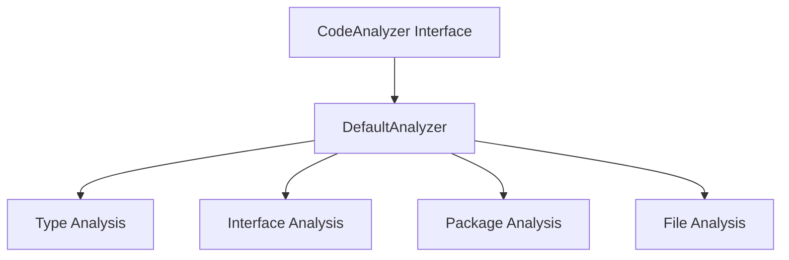

# ReadGo Architecture

## Overview

ReadGo is a Go code analysis tool designed to help developers understand and navigate Go codebases. It provides functionality for analyzing types, interfaces, and package structures, with support for both local and third-party packages.

## Core Components

### 1. Code Analyzer

The core analysis functionality is provided by the `CodeAnalyzer` interface, which is implemented by `DefaultAnalyzer`. It offers:

- Type lookup and analysis
- Interface discovery and analysis
- Package structure analysis
- File-level analysis



### 2. Source Reader

The `SourceReader` interface handles file system operations and code reading:

- File tree traversal
- Source file reading
- Package file discovery
- File search functionality

### 3. Validator

The `Validator` interface provides code validation capabilities:

- File validation
- Package validation
- Project-wide validation

### 4. Caching System

The caching system improves performance by storing analysis results:

- Type lookup cache
- Package analysis cache
- File analysis cache
- TTL-based cache invalidation

## Data Flow

1. Input Processing:
   - File/package path validation
   - Resolution of relative paths
   - Package import path handling

2. Analysis Pipeline:
   ```
   Input -> Cache Check -> Analysis -> Cache Update -> Result
   ```

3. Error Handling:
   - Custom error types for different scenarios
   - Error wrapping for context preservation
   - Detailed error messages

## Performance Considerations

1. Caching:
   - In-memory cache with TTL
   - Thread-safe implementation using sync.Map
   - Automatic cache invalidation

2. Resource Management:
   - Efficient file reading
   - Memory-conscious type analysis
   - Concurrent operations where applicable

## Extension Points

The architecture is designed to be extensible:

1. Interfaces:
   - Custom analyzer implementations
   - Alternative source readers
   - Custom validators

2. Cache:
   - Pluggable cache backends
   - Custom cache key generation
   - Cache strategy customization

## Dependencies

Core dependencies:
- `golang.org/x/tools/go/packages`: Package loading and type checking
- Standard library packages for core functionality

## Security

1. Input Validation:
   - Path sanitization
   - Type safety checks
   - Resource access controls

2. Error Handling:
   - Secure error messages
   - Resource cleanup
   - Timeout mechanisms

## Future Considerations

1. Planned Improvements:
   - Distributed caching
   - Advanced type analysis
   - Performance optimizations
   - IDE integration

2. Potential Extensions:
   - Code generation support
   - Cross-language analysis
   - Custom analysis rules 